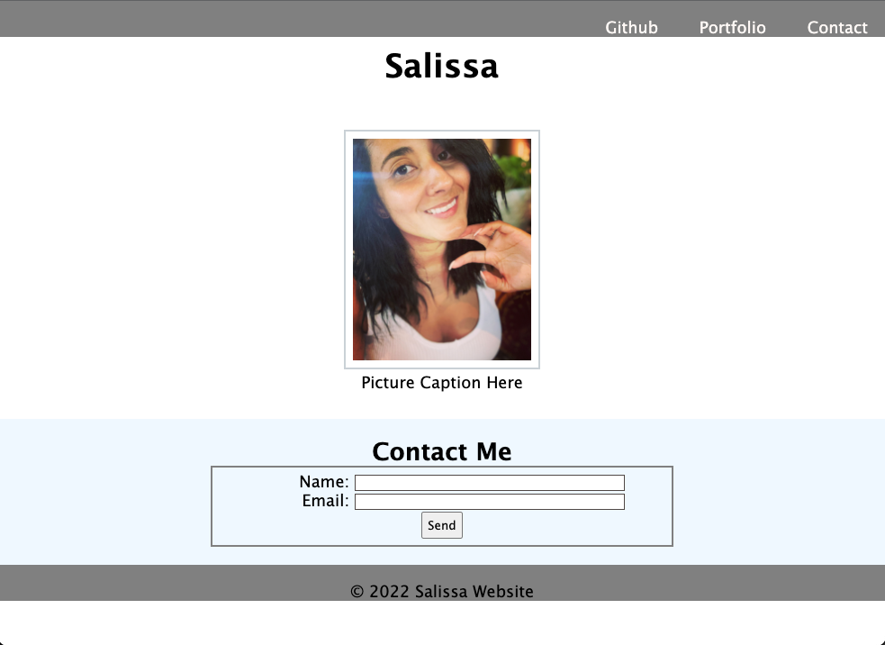

# Mini-Project
Mini project

## Description

Goal: Build a web page with a contact form utilizing semantic HTML and CSS. 

1. Use semantic HTML to build web page
2. Style with external CSS file utilizing universal, element and class selectors.
3. Structure HTML and CSS files to flow logically
4. Ensure the web page has 3 colors in the design
5. The web page uses two heading elements (h1, h2)
6. Position header to fixed
7. Include a contact form for name and email
8. Create a send button
9. Insert an image with a caption and alternate attribute
10. Adhere to accessibility standards
11. Link Github page to navigation bar
12. When user clicks Contact in navigation bar the page jumps to contact form

## Demo

https://salissa4.github.io/Mini-Project/

## Credits

In process

## License

MIT License

Copyright (c) [2022] [Salissa4]

Permission is hereby granted, free of charge, to any person obtaining a copy
of this software and associated documentation files (the "Software"), to deal
in the Software without restriction, including without limitation the rights
to use, copy, modify, merge, publish, distribute, sublicense, and/or sell
copies of the Software, and to permit persons to whom the Software is
furnished to do so, subject to the following conditions:

The above copyright notice and this permission notice shall be included in all
copies or substantial portions of the Software.

THE SOFTWARE IS PROVIDED "AS IS", WITHOUT WARRANTY OF ANY KIND, EXPRESS OR
IMPLIED, INCLUDING BUT NOT LIMITED TO THE WARRANTIES OF MERCHANTABILITY,
FITNESS FOR A PARTICULAR PURPOSE AND NONINFRINGEMENT. IN NO EVENT SHALL THE
AUTHORS OR COPYRIGHT HOLDERS BE LIABLE FOR ANY CLAIM, DAMAGES OR OTHER
LIABILITY, WHETHER IN AN ACTION OF CONTRACT, TORT OR OTHERWISE, ARISING FROM,
OUT OF OR IN CONNECTION WITH THE SOFTWARE OR THE USE OR OTHER DEALINGS IN THE
SOFTWARE.

## Badges

